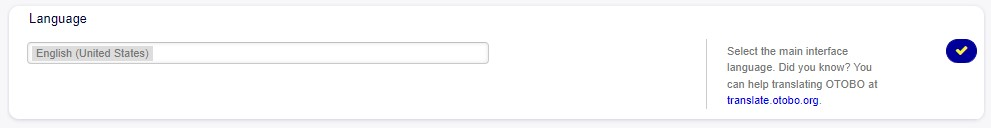
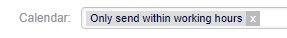
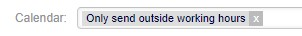
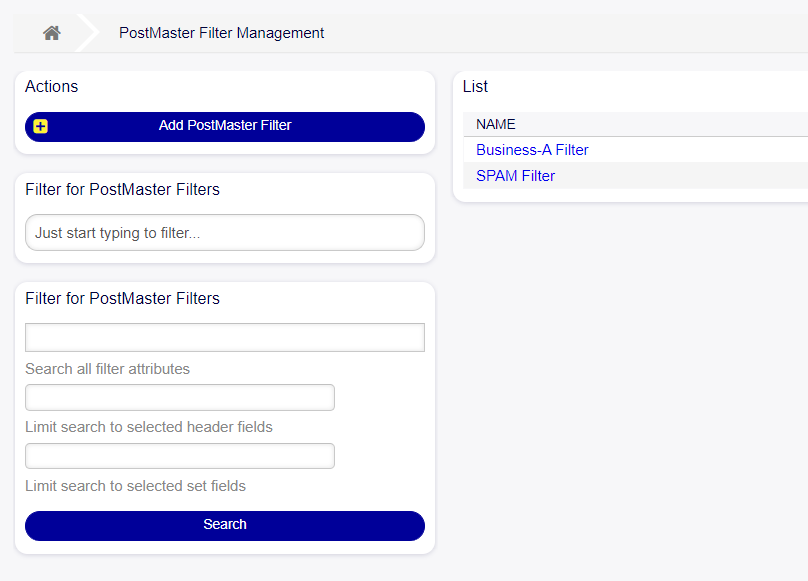
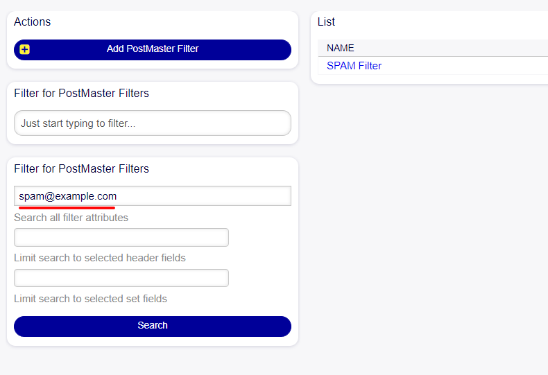

Extension of the Country and Language Selections
~~~~~~~~~~~~~~~~~~~~~~~~~~~~~~~~~~~~~~~~~~~~~~~~~

More languages from various countries have been incorporated, enabling a broader selection of languages for the tool.

Currently, in the personal preferences, it is possible to view and configure all available languages to use in OTOBO.

   Field languages - personal preferences

.. figure:: images/Languages_2.jpg
   :alt: Possible languages

   Possible languages

.. figure:: images/Languages_3.jpg
   :alt: Possible languages 

   Possible languages

.. figure:: images/Languages_4.jpg
   :alt: Possible languages

   Possible languages

Capability to Send Ticket Notifications Only During Working Hours
~~~~~~~~~~~~~~~~~~~~~~~~~~~~~~~~~~~~~~~~~~~~~~~~~~~~~~~~~~~~~~~~~~

A new option has been added to the ticket notification settings. Now, within the recipient's section, an additional field named "Calendar" is displayed.

.. figure:: images/Notification_1.jpg
   :alt: Recipient block configuration

   Recipient block configuration

This field allows for the selection of whether notifications should be sent to recipients during working hours or outside of them:

- Selecting the option for working hours will result in notifications being sent only during the established work schedule.

   Option working hours

- Conversely, choosing the non-working hours option will result in notifications being sent outside of the defined working hours.

   Option outside working hours

Filter funcionalities in PostMaster Filters
~~~~~~~~~~~~~~~~~~~~~~~~~~~~~~~~~~~~~~~~~~~~~~~~~~~~~~~~~~~~~~~~~~

The PostMaster Filters module now includes an enhanced filtering capability that extends beyond simple name-based searches. This advanced filter functionality enables more complex and granular searches, allowing users to input specific criteria, such as an email address, to locate all PostMaster filters that match the given parameter.

   Postmaster Filter Management

The ``Search all filter attributes`` field enables more complex searches.

   Search by All Attributes

The second and third filters allow searching selected header fields and selected set fields, respectively.

