CustomTranslations
~~~~~~~~~~~~~~~~~~~~~~~~~~~~~~~~~~~~~~~~

Item “Translations”
    New or existing translations are managed and administered in the "Translations"

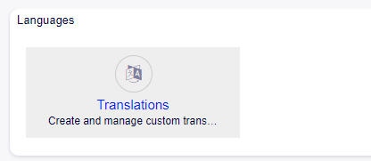

    Widget Languages

   By clicking on the Translations item, the user displays the subaction "Overview".

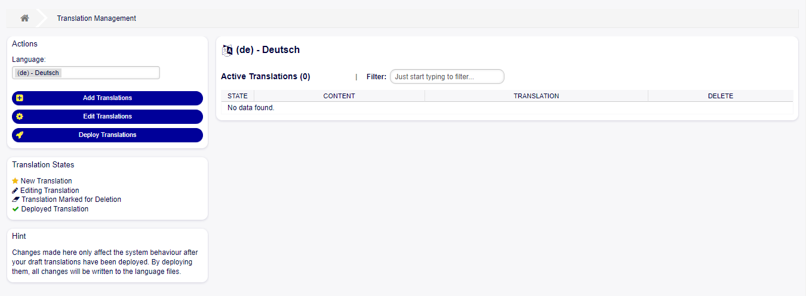

    Overview Module Translations

   It contains the following elements:

Language Dropdown
   To select the working language (By default the language of the User in session is selected).

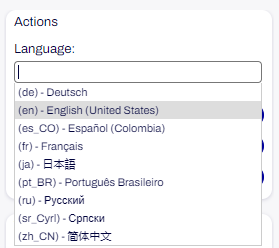

    Actions - Languages

Add Translation
   To add a new translation in the system.

Edit Translations
   To modify an existing translation.

Deploy Translations
   To display the translations in the system.

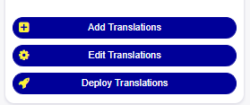

    Buttons Translations

Active Translations 
    Table with all translations displayed.

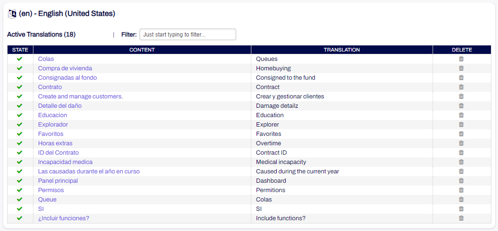

    Table Active Translations

Filter
    To filter the translation table.

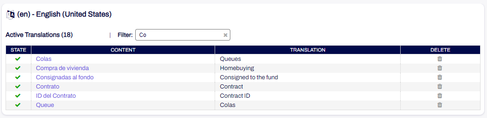

    Filter Active Translations

Translation States
    Possible translation statuses.

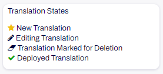

    Widget States Translations
   
- New translation: New translations pending to be deployed.
- Editing Translation: Edited translations pending deployment.
- Translation Marked for Deletion: Translations marked for deletion pending deployment.
- Deployed Translation: Active translations that have already been deployed.

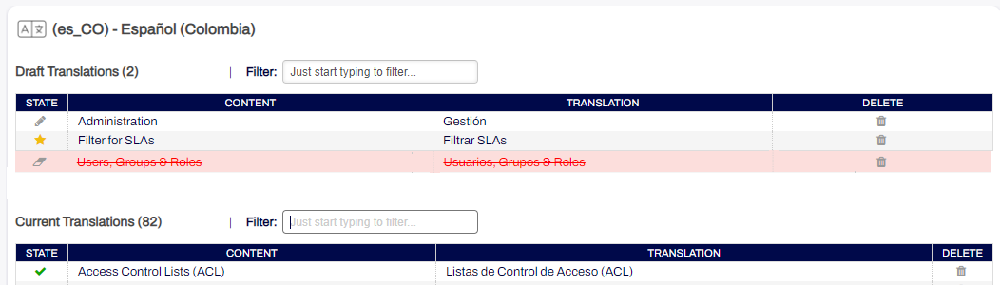

    Display States Translations

Hint
    This widget contains a short explanatory text about the module.

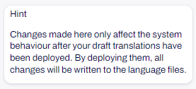

    Widget Hint

Add translation screen
----------------------
    This function allows you to add a new translation to OTOBO and allows you to select each of the translatable data elements in the system.

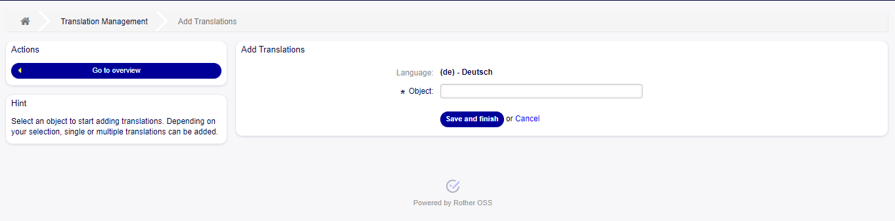

    Overview Add Translation

    When entering the section to add a new translation, a new screen is displayed with the following elements:

Actions
    This widget contains the "Go to Overview" button to return to the main screen of the module.

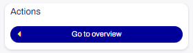

    Widget actions Add Translation

Hint
    This widget contains a short explanatory text about the section the user is in.

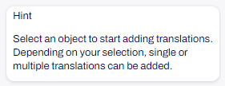

    Widget Hint Add Translation

Language 
    Informative label of the language where the translation will be created.

Object
    Selectable options with element to translate: Dynamic field content, Dynamic field labels, General label, Priorities, Queue, Services, SLA, Templates, Ticket status, Ticket types.

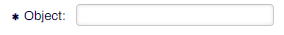

    Object field

Dynamic Field List
    This field is displayed only when "Dynamic Field" is selected in the "Object" field. It contains the names of the dynamic fields.

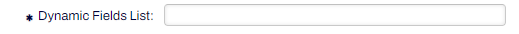

    Dynamic Field List

Content
    This text field contains the tags to translate.

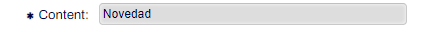

    Content Field

Translation
    Text field or table depending on the selected option, where the translation is entered.

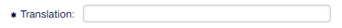

    Translation Field

Button Save and Finish
    To save the translation and finish.

Cancel button
    To cancel the action.

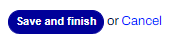

Selectable Options
------------------

Dynamic Field Contents
    Displays all existing dynamic fields and a dropdown field with values to translate is chosen

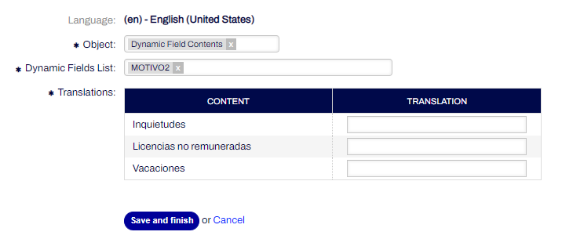

    Table for translation - Dynamic Field Content

Dynamic Field Labels
    Displays all existing dynamic fields in the system and a field is chosen to translate the label

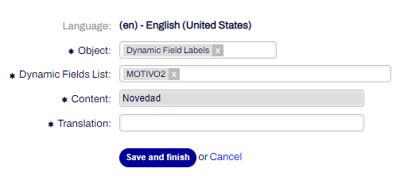

    Table for translation - Dynamic Field Labels
    

General Label
    Allows to translate any existing label in the system.

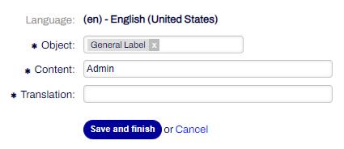

    Fields for translation - General labes
   

Priorities
    Allows to translate the existing priorities in the system.

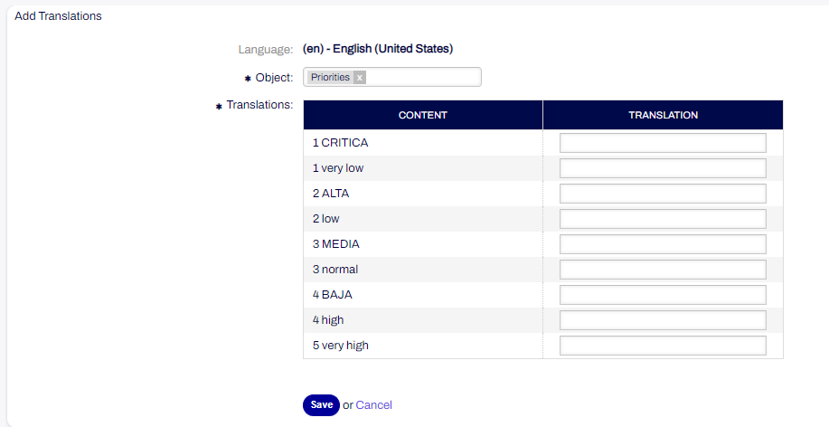

    Fields for translation - Priorities

Queues
    Allows to translate all existing queues.

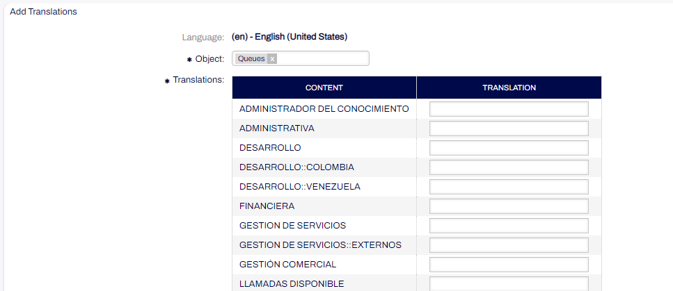

    Fields for translation - Queues

Services
    Allows translation of all services.

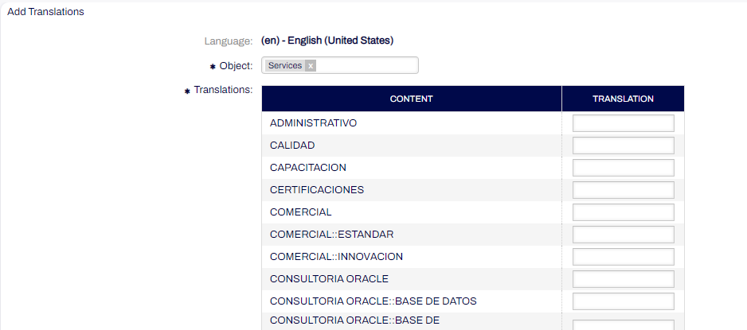

    Fields for translation - Services

SLAs
    Allows translation of all SLAs.

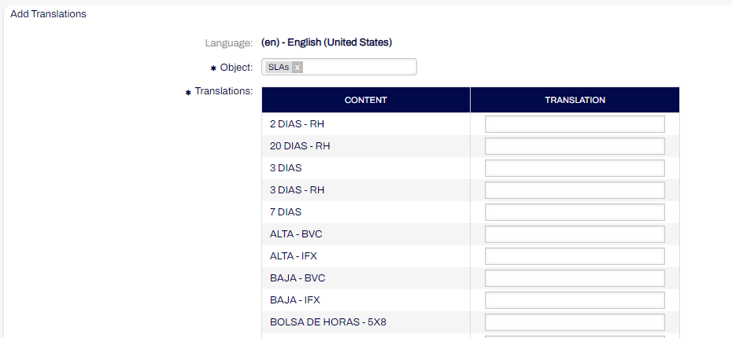

    Fields for translation - SLAs  

Templates
    Allows you to translate templates.

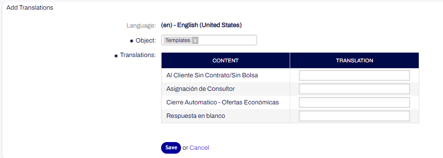

    Fields for translation - Templates

Tickets States
    Allows translation of ticket statuses.

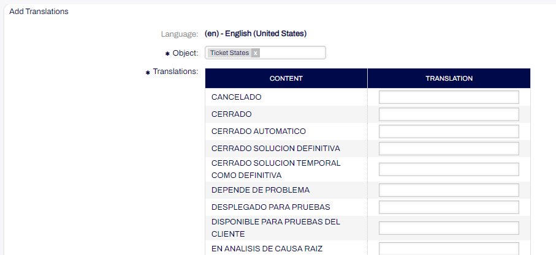

    Fields for translation - Ticket States

Tickets Types
    Allows translation of ticket types.

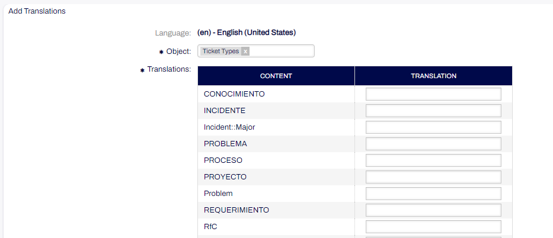

    Fields for translation - Ticket Types

Edit Translation
----------------
    This section allows you to edit the translations displayed in the module. 

    When entering the section to edit translations a new screen is displayed with the following elements:

Translations
    Translation table with

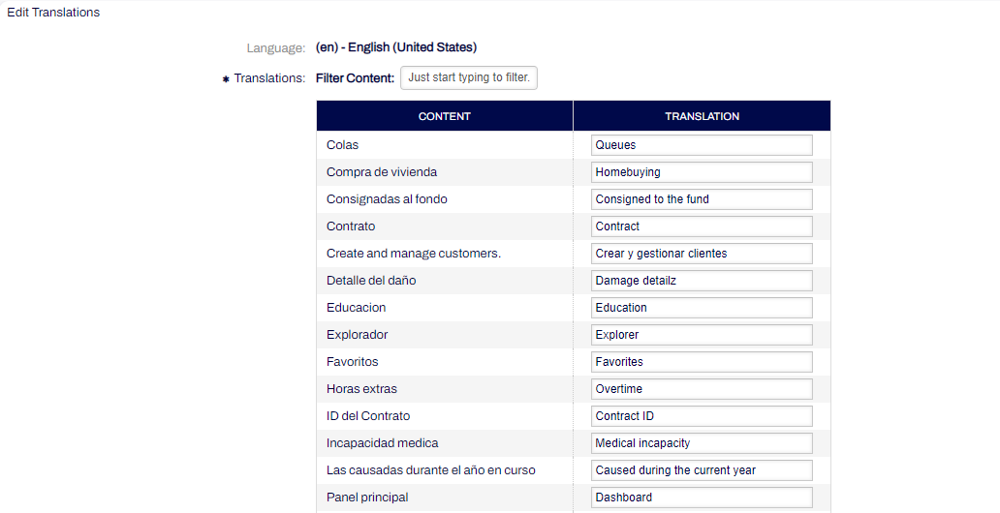

    List of translations for editing

- Filter Content: Translation filtering field.
- Content: content column with all the translated tags in the module.
- Translation: input column with all translations displayed with the possibility to edit and add a new translation.

Deploy Translation
------------------
    This function allows you to deploy translations, changing their status to deployed and adding them to the database or deleting them from the module when they are marked for deletion.

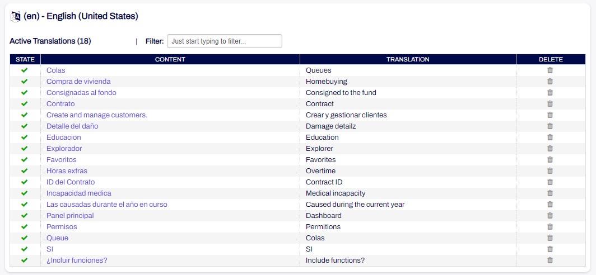

    Table of displayed translations.

Import/Export Translations
--------------------------

    This function allows you to import and/or export files with translations using templates for the different languages configured. 

    When going to the Import/Export module, a new section "Translations" is displayed, a table with the existing templates for importing files.

Add Template
    When adding a new template, the new "Translations" option is displayed in the "Object" input.

Format
    Allows you to choose the CSV file format.

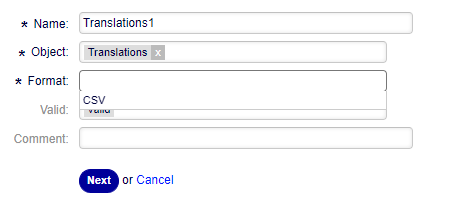

    Fields Add template.

   In the second step, the following fields are displayed:

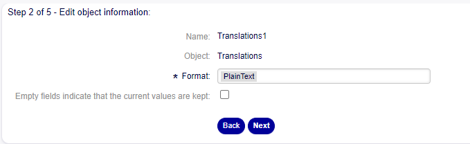

    Fields Step 2.

Format
    Plain text format is selected.

Checkbox
    To indicate whether empty fields keep the current values.

    In the third step the following new fields are displayed:

Column Separator
    Allows you to choose the column separator between Colon (:), Comma(,), Period(.), Semicolon(;), Tabulator (TAB).

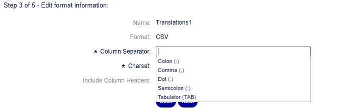

    Field Column separator Step 3.

Charset
    The default character encoding is unmodifiable and according to the previously selected language.

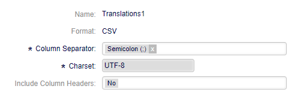

    Field Charset Step 3.

Include Column Headers
    Allows you to choose between yes/no if the option is whether the file should have the column headers in the file to be imported.

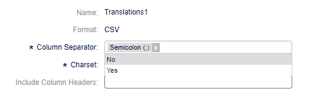

    Field Include Column Headers Step 3.

    In the fourth step, the order of the file columns is defined:

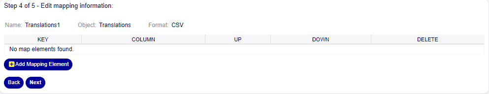

    Information mapping table.

Add Mapping Element
    To add the sections or columns of the file.

Key
    Source string: Text string to be translated.
    Translation English: Language in which the translation will be done.

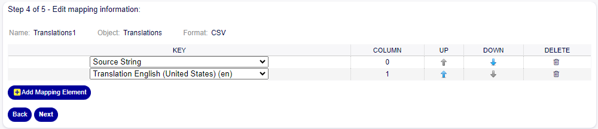

    Mapped information.

    In the fifth step you define whether you want to export untranslated strings of specific objects:

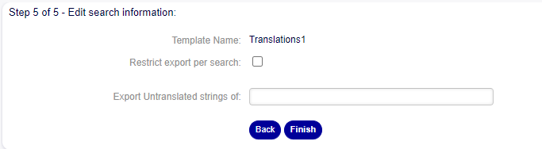

    Search information.

Restrict export per search
    allows you to choose whether you want to restrict the export by searching for specific options.

Export Untranslated strings of
    allows you to choose the option from which the untranslated strings will be exported.

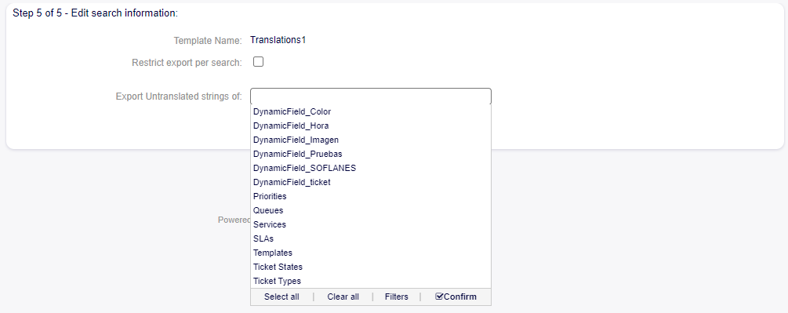

    Field Export Untraslated.

Ticket Information (Translation)
---------------------------------
    Attributes of the ticket such as Queues and Services that are translated using the translation module will be visible in the selection tree views of the fields.

Services in English

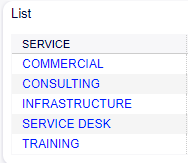

    List Services.

Services translated to Spanish in tree view

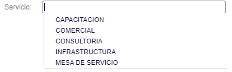

    List Services translated to Spanish.

Queues in English

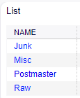

    List Queues.

Queues translated to Spanish in tree view

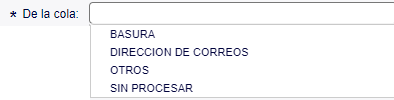

    List Queues translated to Spanish.

