Edit Articles
~~~~~~~~~~~~~~~~~~~~~~~~~~~~~~~~~~~~~~~~
    With this new functionality, it is possible to edit internal articles within tickets.

Ticket Creation
    Tickets are created from any form: "Create New Phone Ticket - Create New Email Ticket - Create New Process Ticket - Issue a new Ticket(Customer)".

Create Internal Article
   An internal note is created from possible article forms: "Agent Ticket Pending - Agent Ticket Note - Agent Ticket Owner - Agent Ticket Priority - Agent Ticket FreeText".

Edit
----
    When selecting the internal note, the Edit button is enabled.
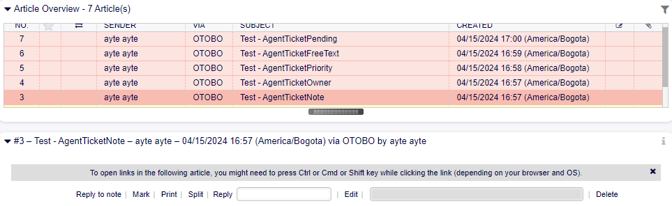

    Button Edit.

Agent Ticket Article Edit
    Clicking on Edit proceeds to display a new screen, where the following options are enabled:

Ticket Settings
    Displays dynamic ticket fields published in the edit form.

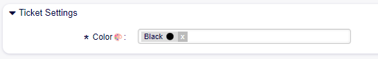

    Field Ticket Settings.

Add Article
- Subject: Enables editing the subject field.
- Article: Enables editing the body text field.

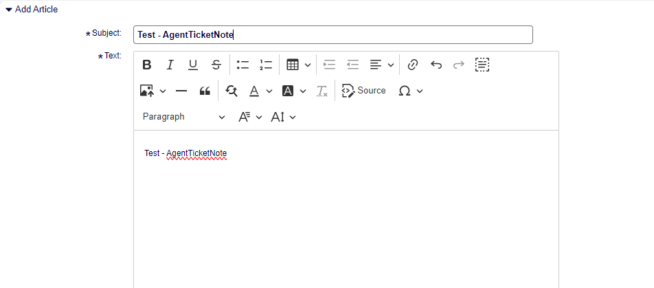

    Fields Add Article.

Attachments
    Displays the field for attaching files to the article.

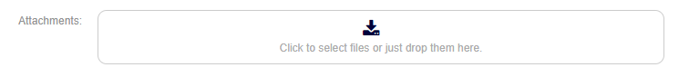

    Field Attachment.

Article Dynamic Field
    Enables editing the value of dynamic article type fields published on the edit screen.

    Dynamic Field Article - 'Test'.

Submit
    Used to save changes.

    Button Submit.
    

Article Versions
----------------

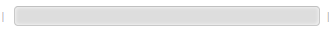

    Versions button disabled.

    The field to view article versions is enabled after editing a note, showing the version number and the date it was edited.

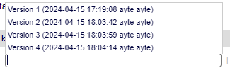

    History Versions.

- Version 1
    Version #1 of the articles shows the original note without modifications.

- Version 2
    Version #2 is the first edit of the original article.

- Version 3
    Version #3 is the second edit made to Version #2, and new modifications will be added consecutively.

Delete
------
    There is the possibility to delete internal articles of the ticket with the "Delete" button located to the right of the versioning dropdown field.

    Delete Button.

    Using the delete button marks the article as deleted.

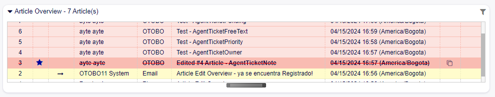

    Deleted Article.

Hide Deleted Articles
    In the top menu bar where links to note forms are located, a new button is now displayed that allows hiding deleted articles from the Article Overview.

    Button Hide deleted articles.

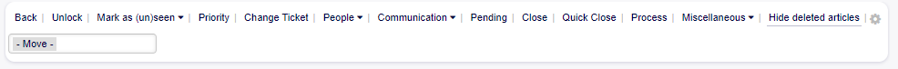

    Button Hide deleted articles.
   

Show deleted articles
    After hiding deleted articles, the button to show deleted articles is enabled in the Article Overview.

    Button Show deleted articles.

Restore
-------
    After deleting articles, the button to restore the deleted article is enabled. To view the article, it must be visible and selected. The restore button will now appear where the delete button was displayed.

.. figure:: images/RestoreDeletedArticle_2.png
   :alt: Menu buttons Article.   

         Menu buttons Article.   

         Buttons restore Article.   

    

History
-------
    Every time a modification is made to the articles, it is recorded in the ticket's history.

Article Modification

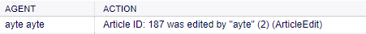

         History action of Modification. 

Modification of the value of dynamic Article and Ticket type fields

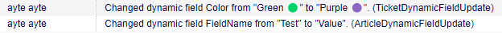

         History action of Modification value Dynamic Field. 

Deletion of articles.

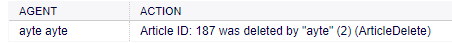

         History action of Deletion. 

Restoration of articles.

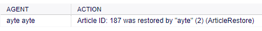

         History action of Restoration. 
