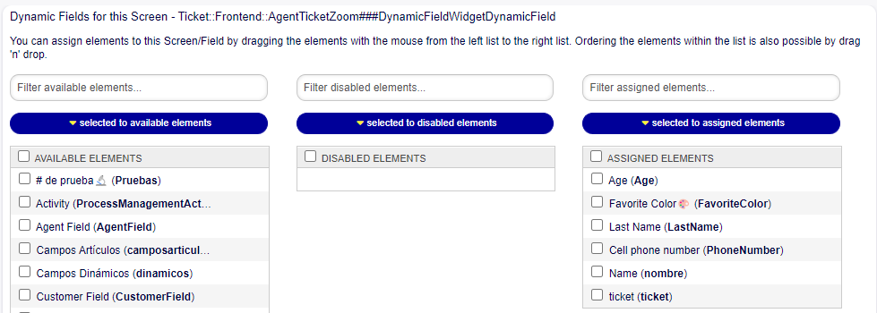
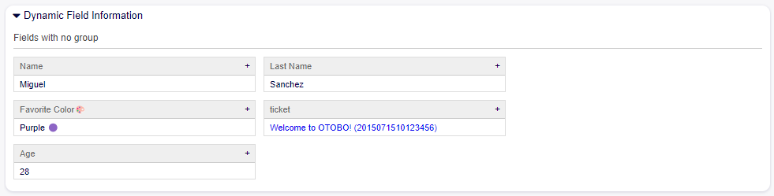
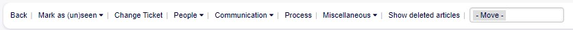
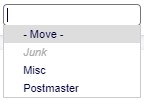
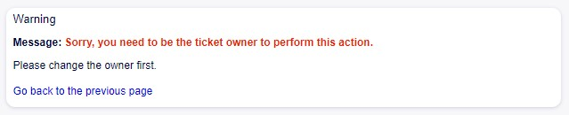

New DynamicField-Widget (similar to ProcessWidget)
~~~~~~~~~~~~~~~~~~~~~~~~~~~~~~~~~~~~~~~~~~~~~~~~~~~~~

Upon entering the Dynamic Fields for this Screen module and selecting the ``DynamicFieldWidgetDynamicField``, it allows enabling fields for this display.

   Dynamic field Screen

After submitting, dynamic fields with the selected value for each field will be displayed in a widget on the AgentTicketZoom.

   Widget Dynamic Field - AgentTicketZoom

Possibility to move a locked ticket to another queue
~~~~~~~~~~~~~~~~~~~~~~~~~~~~~~~~~~~~~~~~~~~~~~~~~~~~~

A new feature has been introduced in the System Configuration that allows for the transfer of a ticket to another queue, even if the user is not the owner.

Within the ticket options menu in the view (AgentTicketZoom), a dropdown field named "Move" has been added. Upon selecting this option, the available queues to which the ticket can be moved are displayed.

   Options menu- AgentTicketZoom

   Drop-down field move

If the user is not the owner of the ticket, an error message will be displayed: "Sorry, you need to be the ticket owner to perform this action."

   Error when moving the ticket - Functionality disabled

Enabling New Functionality
--------------------------
By enabling the checkbox Ticket::Frontend::MoveType::Dropdown::MoveEvenIfLocked in the system configuration,

   Functionality configuration widget enabled

After enabling it, it is possible to use the move field without being the ticket owner, and the change to the selected queue will be made.
