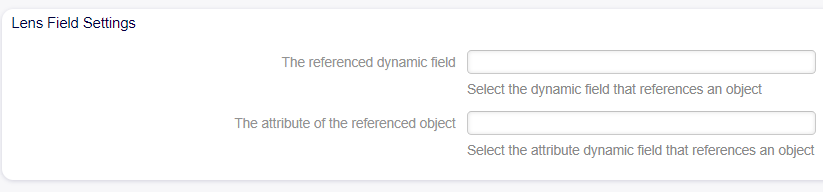

Script Dynamic Field Settings
~~~~~~~~~~~~~~~~~~~~~~~~~~~~~~~~~~~~~~~~

This dynamic field 'Script' allows you to calculate expressions based on the Toolkit Template language, as long as the conditions defined during the field creation are met.

.. figure:: images/dynamic-field-script.png
   :alt: Script Dynamic Field Settings

   Script Dynamic Field Settings

Expression Field
   In the ``Expression field``, the function to be evaluated will be defined. Example:

   ::

      [% Data.QueueID * 5 %]

Requirements 
   List of attributes that function as conditions. If one or more attributes are chosen, the function will only be executed if the attributes have valid values ​​set.

Preview Triggers 
   If configured, the function will be re-evaluated via AJAX every time the value of the selected attribute or attributes is updated.

Storage Triggers (Events) 
   If one or more events from the list are selected, the expression will be re-evaluated every time the event or events occur.

Show link 
   Here you can specify an optional HTTP link for the field value in overviews and zoom screens. Example:

   ::

      http://some.example.com/handle?query=[% Data.Field1 | uri %]

Link for preview
   If filled in, this URL will be used for a preview which is shown when this link is hovered in ticket zoom. Please note that for this to work, the regular URL field above needs to be filled in, too.

Check RegEx
   Here you can specify a regular expression to check the value. The regex will be executed with the modifiers ``xms``. Example:

   ::

      ^[0-9]$

Add RegEx
   Clicking on the *⊞* button will add two new fields, where a regular expression and an error message can be added.

Lens Dynamic Script Settings
~~~~~~~~~~~~~~~~~~~~~~~~~~~~~~~~~~~~~~~~

The Lens field allows referencing objects within OTOBO, along with their characteristics, enabling the display and/or editing of them.

   Lens Dynamic Field Settings

The referenced dynamic field
   Here you can set up a dynamic field that references an object within OTOBO, such as Agent, Customer (User), Ticket, CI, and CI Version.

The attribute of the referenced object
   Here you can reference an attribute of the related object. For example, accessing an attribute of a related CI in the referenced dynamic field.

