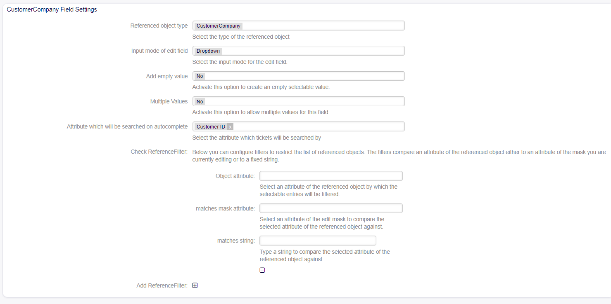

Reference Dynamic Field Settings
~~~~~~~~~~~~~~~~~~~~~~~~~~~~~~~~~~~~~~~~

The Reference dynamic field allows you to point to an object within OTOBO such as an Agent, Customer, Company, or Ticket, from a dynamic field.

.. figure:: images/dynamic-field-reference-options.png
   :alt: Reference Dynamic Field Options

   Reference Dynamic Field Options

Reference Dynamic Field  -  Agent 
~~~~~~~~~~~~~~~~~~~~~~~~~~~~~~~~~~~~~~~~

Allows creating a field that displays created agents.

Field Configuration
------------------------
Standard configuration for all fields is displayed.

.. figure:: images/FieldConfiguration_1.jpg
   :alt: General dynamic field configuration

   General dynamic field configuration

Field Configuration Reference
------------------------------------
.. figure:: images/FieldConfigurationReference.jpg
   :alt: Field configuration Reference Agent

   Field configuration Reference Agent

Referenced object type
------------------------------------
    Displays the selected reference type.

Input mode of edit field
------------------------------------
    Allows selecting the mode in which the field will be used:

AutoComplete
------------------------------------
.. figure:: images/Autocomplete_1.jpg
   :alt: Configuration Autocomplete 

         Configuration Autocomplete 

    Autocompletes values as they match the characters used.

.. figure:: images/Autocomplete_2.jpg
   :alt: Display Autocomplete 

         Display Autocomplete 

Dropdown
------------------------------------
.. figure:: images/Dropdown_1.jpg
   :alt: Configuration Dropdown 

         Configuration Dropdown 

    Displays field values as a dropdown type.

.. figure:: images/Dropdown_2.jpg
   :alt: Display Dropdown

         Display Dropdown

Multiselect
------------------------------------
.. figure:: images/Multiselect_1.jpg
   :alt: Configuration Multiselect

         Configuration Multiselect

    Allows selecting multiple values for the field.

.. figure:: images/Multiselect_2.jpg  
   :alt: Display Multiselect

         Display Multiselect

Add empty value
------------------------------------
.. figure:: images/AddEmptyValue_1.jpg
   :alt: Configuration AddEmptyValue

         Configuration AddEmptyValue

    Selecting Yes in this option allows the field to be empty.
.. figure:: images/AddEmptyValue_2.jpg
   :alt: Display AddEmptyValue yes

         Display AddEmptyValue yes

    Selecting No in this option does not allow the field to be empty.
.. figure:: images/AddEmptyValue_3.jpg
   :alt: Display AddEmptyValue no

         Display AddEmptyValue no

Group of the Agents
------------------------------------
    Allows selecting the group of agents to be displayed in the field.
.. figure:: images/GroupAgents.jpg
   :alt: Configuration GroupAgents

         Configuration GroupAgents

Reference Dynamic Field Customer Company
~~~~~~~~~~~~~~~~~~~~~~~~~~~~~~~~~~~~~~~~~~~~~~~

   Company Reference Dynamic Field Settings

Referenced object type
   Here we indicate the type of object to be referenced in the dynamic field.

Input mode of edit field
   Here you can select the mode in which available company customers will be displayed. It can be 'Autocomplete', 'Dropdown', or 'Multiselect'.

Add empty value
  If this option is activated, an extra value is defined to show as a - in the list of possible values. This special value is empty internally.

Multiple Values
  Activating this option allows the field to have multiple values.

Attribute which will be searched on autocomplete
  Here, you can select the attribute by which tickets will be searched.

Check ReferenceFilter
  You can configure filters to limit the results of the list of referenced objects.

Add Reference Filter
  Allows adding more fields (Object attribute - Matches mask attribute - Matches string) to filter.

  Object attribute
    Here, you select an attribute of the company customer by which selectable entries will be filtered.

  Matches mask attribute
    Selects an attribute of the edit mask to compare with the selected attribute of the referenced object. This means that the value of the attribute of the referenced object will be compared with the value of the same attribute in the current edit mask.

  Matches string
    Enter a text string that will be used as a criterion to determine if there is a match between the value of the attribute of the referenced object and this string you provided.

Reference Dynamic Field Customer User
~~~~~~~~~~~~~~~~~~~~~~~~~~~~~~~~~~~~~~~~~~

.. figure:: images/dynamic-field-reference-customer-user.png
   :alt: Customer User Reference Dynamic Field Settings

   Customer User Reference Dynamic Field Settings

Referenced object type
   Here we indicate the type of object to be referenced in the dynamic field.

Input mode of edit field
   Here you can select the mode in which available company customers will be displayed. It can be 'Autocomplete', 'Dropdown', or 'Multiselect'.

Add empty value
  If this option is activated, an extra value is defined to show as a - in the list of possible values. This special value is empty internally.

Multiple Values
  Activating this option allows the field to have multiple values.

Check ReferenceFilter
  You can configure filters to limit the results of the list of referenced objects.

Add Reference Filter
  Allows adding more fields (Object attribute - Matches mask attribute - Matches string) to filter.

  Object attribute
    Here, you select an attribute of the company customer by which selectable entries will be filtered.

  Matches mask attribute
    Selects an attribute of the edit mask to compare with the selected attribute of the referenced object. This means that the value of the attribute of the referenced object will be compared with the value of the same attribute in the current edit mask.

  Matches string
    Enter a text string that will be used as a criterion to determine if there is a match between the value of the attribute of the referenced object and this string you provided.

Reference Dynamic Field -  Ticket
~~~~~~~~~~~~~~~~~~~~~~~~~~~~~~~~~~~~~~~~~~~~
Allows selecting created tickets.

Field Configuration
------------------------

.. figure:: images/FieldConfigurationTk.jpg
   :alt: Field configuration Reference Ticket

         Field configuration Reference Ticket
   

Referenced object type
------------------------
    Displays the selected reference type.

Input mode of edit field
------------------------
    Allows selecting the mode in which the field will be used:

AutoComplete
------------------------
.. figure:: images/Autocomplete_1Tk.jpg
   :alt: Configuration Autocomplete Ticket 

         Configuration Autocomplete Ticket 

    Autocompletes values as they match the characters used.

.. figure:: images/Autocomplete_2Tk.jpg
   :alt: Display Autocomplete Ticket

         Display Autocomplete Ticket

Dropdown
------------------------
.. figure:: images/Dropdown_1Tk.jpg
   :alt: Configuration Dropdown Ticket

         Configuration Dropdown Ticket

    Displays field values as a dropdown type.

.. figure:: images/Dropdown_2Tk.jpg
   :alt: Display Dropdown Ticket

         Display Dropdown Ticket

Multiselect
------------------------
.. figure:: images/Multiselect_1Tk.jpg
   :alt: Configuration Multiselect Ticket

         Configuration Multiselect Ticket

    Allows selecting multiple values for the field.

.. figure:: images/Multiselect_2Tk.jpg
   :alt: Display Multiselect Ticket

         Display Multiselect Ticket

Add empty value
------------------------
.. figure:: images/AddEmptyValue_1Tk.jpg
   :alt: Configuration AddEmptyValue Ticket

         Configuration AddEmptyValue Ticket

    Selecting Yes in this option allows the field to be empty.
.. figure:: images/AddEmptyValue_2Tk.jpg
   :alt: Display AddEmptyValue Ticket yes

         Display AddEmptyValue Ticket yes

    Selecting No in this option does not allow the field to be empty.
.. figure:: images/AddEmptyValue_3Tk.jpg
   :alt: Display AddEmptyValue Ticket no

         Display AddEmptyValue Ticket no

Attribute which will be searched on autocomplete
------------------------------------------------------------------------
    To select which attribute to filter the ticket (Title or Number).
.. figure:: images/Attribute_1.jpg
   :alt: Configuration Attribute (Title or Number)

         Configuration Attribute (Title or Number)

Attribute which will be searched on autocomplete
------------------------------------------------------------------------
    Allows selecting which values will be displayed in the list.
.. figure:: images/Attribute_2.jpg
   :alt: Configuration Attribute which will be searched on autocomplete

         Configuration Attribute which will be searched on autocomplete

Check ReferenceFilter
------------------------
    It is possible to configure filters to limit the list of tickets displayed in the field.
.. figure:: images/ReferenceFilter.jpg
   :alt: Configuration ReferenceFilter

         Configuration ReferenceFilter

    Object attribute
    
        Allows selecting a property of the ticket that you want to use to filter the entries displayed in the field.

    Matches mask attribute
        Selects an attribute of the edit mask to compare with the selected attribute of the referenced object. This means that the value of the attribute of the referenced object will be compared with the value of the same attribute in the current edit mask.

    Matches string
        Enter a string of text that will be used as a criterion to determine if there is a match between the value of the attribute of the referenced object and this string you provided.

    Add Reference Filter
        Allows adding more fields (Object attribute - Matches mask attribute - Matches string) for filtering.
