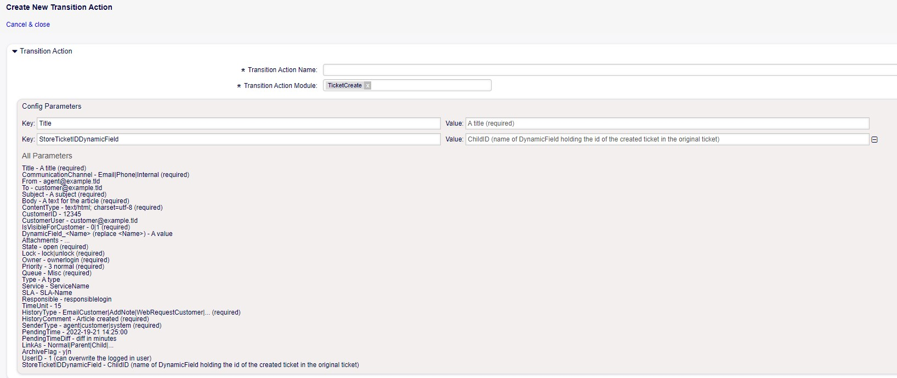
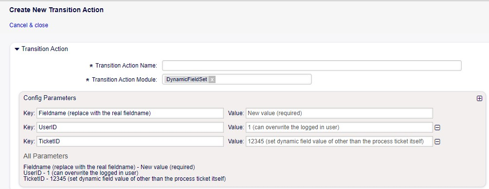
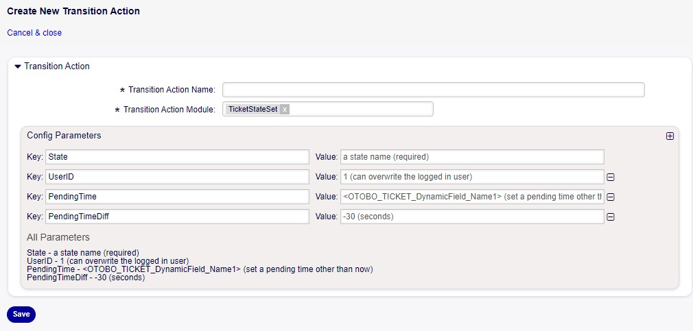

Internal Transaction
~~~~~~~~~~~~~~~~~~~~~
New field-value functionalities have been added to transition action modules.

TicketCreate
-------------
    It now features a new field named "StoreTicketIDDynamicField," where you can specify a dynamic field name. This field will store the ID of the newly created ticket in the current process ticket.

    Transition Action Module TicketCreate

DynamicFieldSet 
---------------
    A new field called "TicketID" has been added, allowing you to provide a TicketID (for example, one stored in 1.). This enables you to set a dynamic field value for a ticket other than the current process ticket.

    Tansition Action Module DynamicFieldSet

TicketStateSet
    Introduces "PendingTime," enabling you to set an absolute pending time instead of relying solely on the old "PendingTimeDiff." These two values can be combined to indicate, for example, "5 minutes after this date."

    Transition Action Module TicketStateSet   
