Light Admin
~~~~~~~~~~~~~~
Enables controlled access to specific administrative functions by designated user groups.

Creation of the Light Group
   Within the Groups module, the creation of the new group named "light" is carried out.

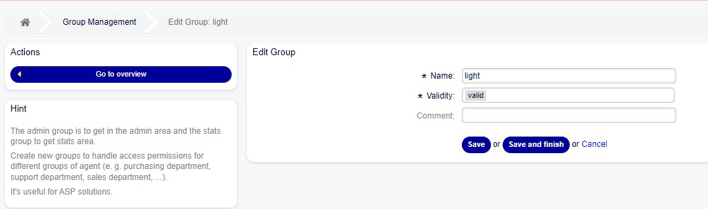

   Group creation screen

Assignment of Users to the "light" Group
   Through the Agents-Groups module, the assignment of one or several users to the newly created group is performed.

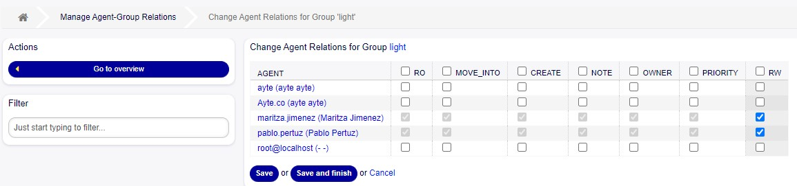

   Relationship agents - groups

   
Parametrization of "light" in the System Configuration

   It is essential to add the light group to the actions ``Frontend::Module###Admin`` - ``Frontend::Navigation###Admin###001-Framework`` with the GruopRo value, in order to enable the Admin option in the top menu for users subscribed to the group.

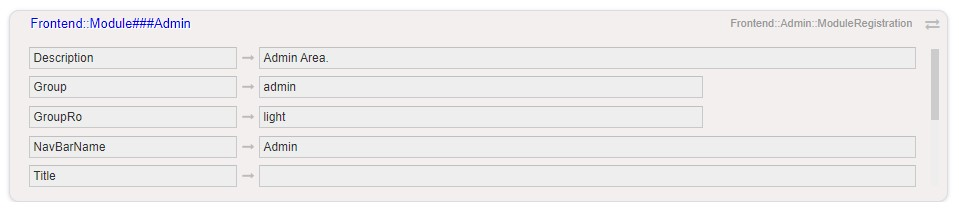

   Widget configuration Frontend::Module###Admin

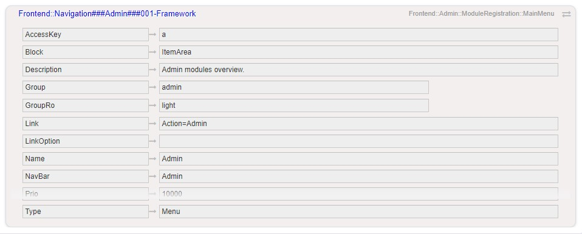

   Widget configuration Frontend::Navigation###Admin###001-Framework

   Activation of the Administration Module

   Subsequently, the necessary permissions are configured to access specific administration modules, for example, ticket notifications: ``Frontend::Module###AdminNotificationEvent`` - ``Frontend::NavigationModule###AdminNotificationEvent``.

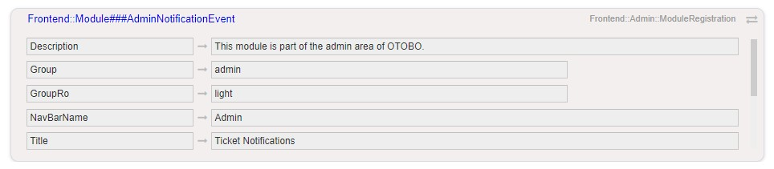

   Widget configuration Frontend::Module###AdminNotificationEvent

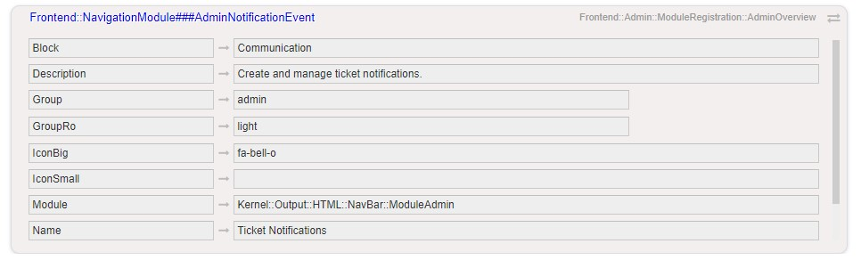

   Widget configuration Frontend::NavigationModule###AdminNotificationEvent

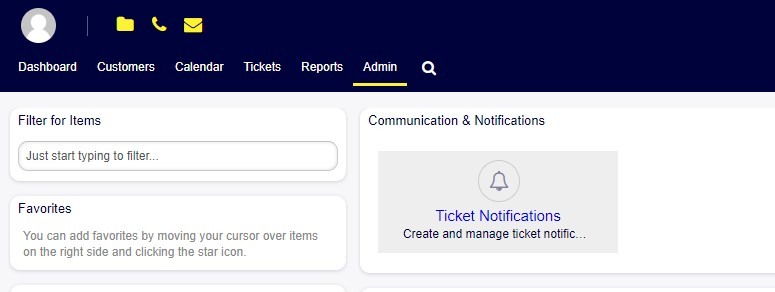

   Admin - Ticket Notifications Module

Assignment of Queue to the "light" Group
   To allow the creation and editing of specific notifications for a particular queue, it is necessary to assign the light group to the queue, for example, "Raw" in this instance.

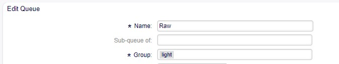

   Queue configuration

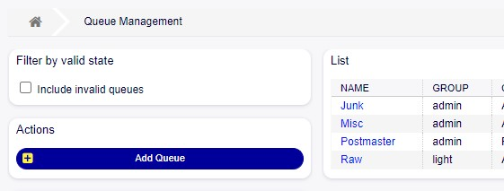

   Queue list

Creation and Editing of Specific Notifications for the Parametrized Queue
   When accessing ticket notifications, users can view predefined notifications, but they only have permission to edit and create notifications for the parametrized queue.

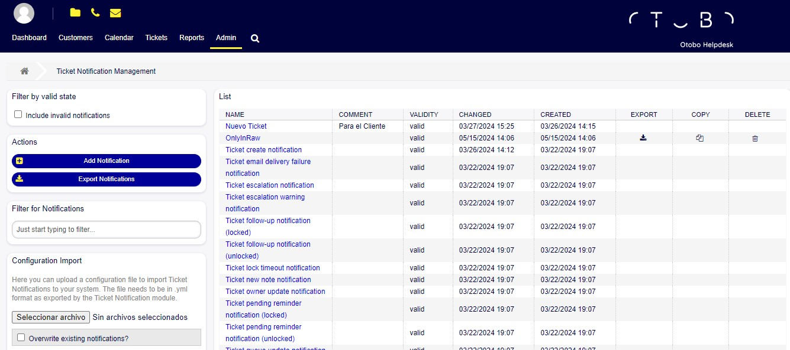

   Ticket Notification Management

- In notifications where the "Raw" queue is not parameterized, modification of the configuration is restricted, and save buttons are disabled.

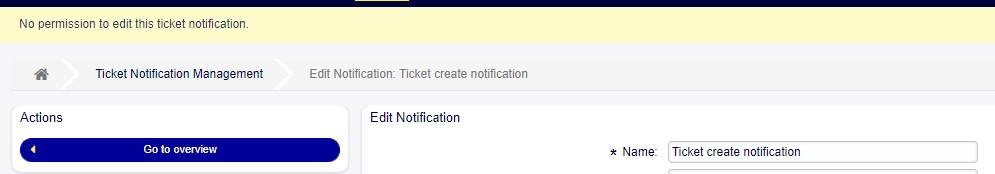

   No permission to edit the notification

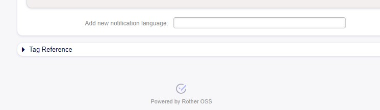

   Saving buttons disabled

- Conversely, in notifications with a configured "Raw" queue, modification of the notification is permitted, and save buttons are enabled.

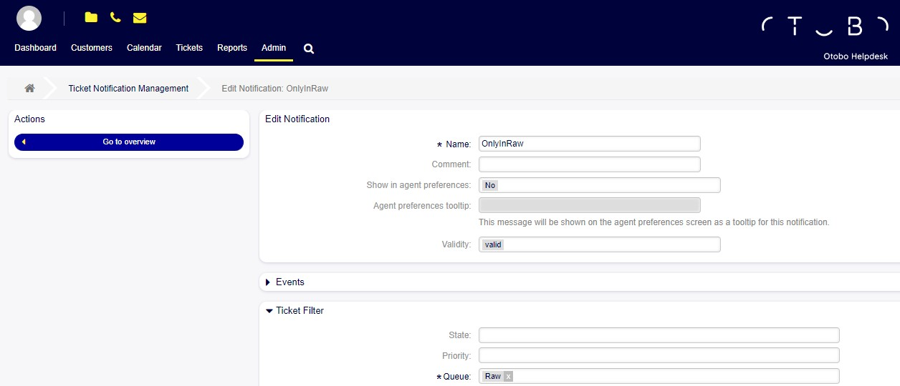

   Permission to edit the notification

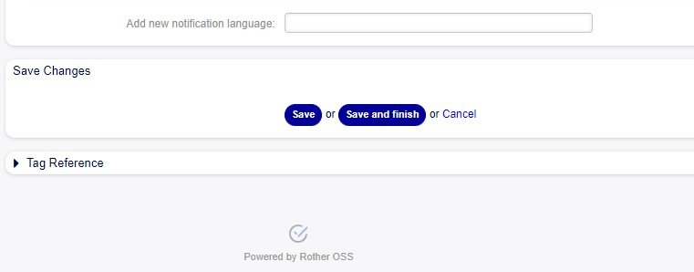

   Saving buttons enabled

- When creating a new notification, it is mandatory to assign a queue, and only the "Raw" option is enabled.

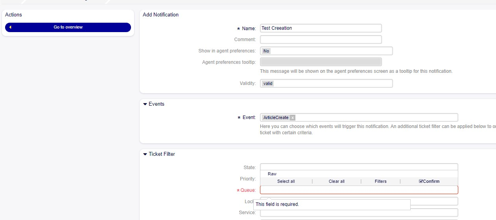

   Queue configuration required

Flexibility is provided by allowing parametrization with any desired queue. This functionality is achieved by assigning the "light" group to the specific queue that requires configuration.

Light Admin provides an efficient and easily manageable solution, allowing precise customization without compromising system integrity. This adaptability ensures that features such as greetings, signatures, notifications, and templates are managed optimally according to the specific requirements of each workspace.

