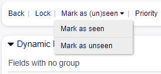
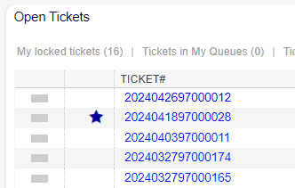

Mark Ticket Seen Unseen
~~~~~~~~~~~~~~~~~~~~~~~~~~~~~~~~~~~~~~~~

Now ticket articles can be marked as "seen" or "unseen" in the action bar of AgentTicketZoom.

   Ticket Seen Unseen View

When marking an article as "unseen," it will be displayed in the main panel with the distinctive star symbol indicating that an article has not been viewed yet.

   Unseen Marked Ticket
