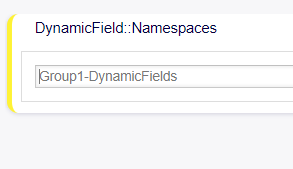

Namespaces
~~~~~~~~~~~~~~~~~~~~~~~~~~~~~~~~~~~~~~~~

Now OTOBO allows the creation of namespaces for dynamic fields. This feature enables organizing and structuring dynamic fields into groups, facilitating management and identification within the platform.

Namespaces act as prefixes for the names of dynamic fields. When creating a new dynamic field, you can assign a specific namespace, adding clarity and coherence to OTOBO's dynamic field management system.

To add a new namespace, navigate to the system configuration, under the setting: DynamicField::Namespaces.

With one or more namespaces created, they can be selected in the 'Namespace' option within the dynamic field creation form.

.. figure:: images/namespaces-2.png
   :alt: Namespaces field in Dynamic Field Creation

Once a dynamic field is added to a namespace, its name will appear in the following format:

.. figure:: images/namespaces-3.png
   :alt: Namespaces field in Dynamic Field Creation

.. note::
  To use it in the Ticket Mask, you should call it by its name, using the namespace to which it belongs as a prefix.

.. figure:: images/namespaces-4.png
   :alt: Namespaces in Ticket Masks
