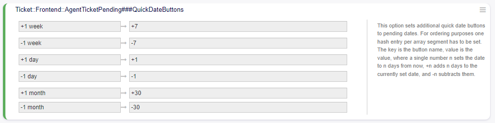
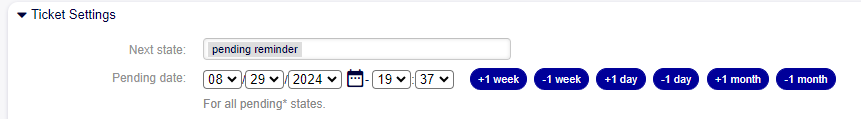

Buttons for Activity Dialogs
============================

By enabling the ``Ticket::Frontend::AgentTicketPending###QuickDateButtons`` module in the system configuration, you can parameterize the time that adds or subtracts the date button in the AgentTicketPending form.

.. figure:: images/QuickDateButtons_1.png
    :alt: Ticket::Frontend::AgentTicketPending###QuickDateButtons

    Ticket::Frontend::AgentTicketPending###QuickDateButtons

    Configuration - Ticket::Frontend::AgentTicketPending###QuickDateButtons

The parameterization is done by days, thus sets of days such as weeks and months can be created.

When opening the AgentTicketPending form, the parameterized buttons configured in the system settings to add a day, a week, or a month to the pending date are observed.

    Display Quick Date Buttons.
