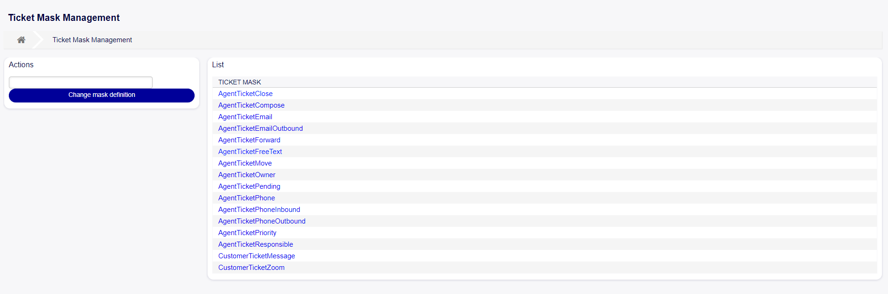
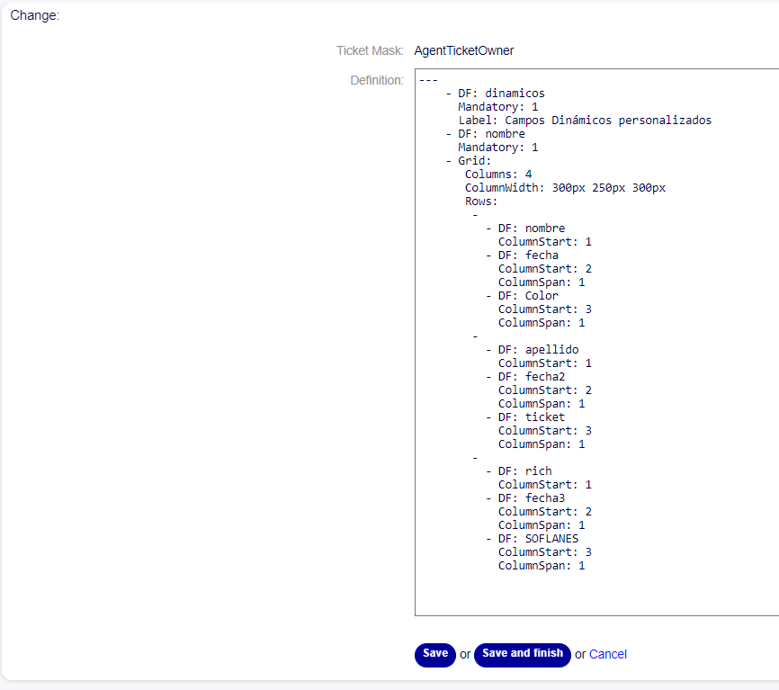
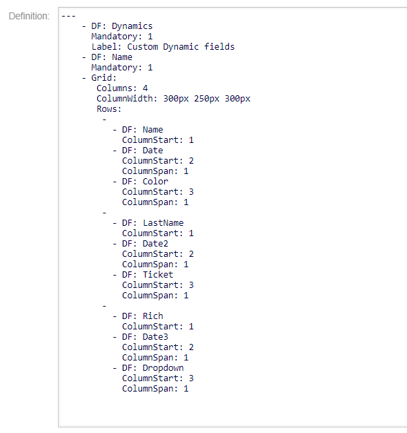
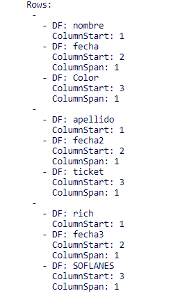
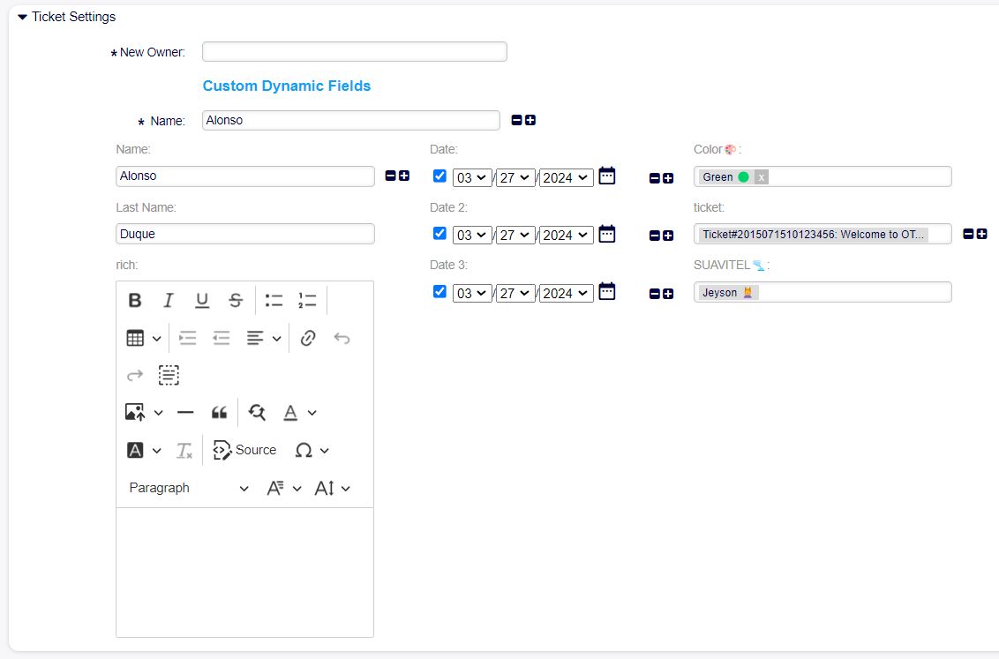

Ticket Masks Settings
~~~~~~~~~~~~~~~~~~~~~~~~~~~~~~~~~~~~~~~~

Consistency and efficiency in handling customer inquiries are fundamental aspects for service desks aiming for excellence. The ability to customize and organize dynamic fields in ticket forms in a specific manner is essential to ensure an optimal experience for users.

The 'Ticket Masks' feature in OTOBO allows users to create customized templates that enable them to define the order and appearance of dynamic fields in forms precisely. This feature offers the flexibility to set titles, labels, and presentation formats such as grids, as well as the ability to make fields read-only and store multiple values for a single field in a single form.

With 'Ticket Masks', agents can streamline ticket management by tailoring the presentation of information to the specific needs of each situation, leading to greater operational efficiency and a more satisfying user experience.

Use this screen to add Ticket masks for use in communications. A new OTOBO installation already contains Ticket masks for all existing actions. The ticket mask management screen is available in the Ticket mask module of the Processes and Automation group.

   Ticket Mask Management Screen

Ticket Mask management
------------------------

To edit a ticket mask in OTOBO, follow these steps:

1. Click on the "Action" field in the left sidebar and select the action for which you want to edit the ticket mask.
2. Click on the "Change mask definition" button in the left sidebar.
3. Fill in the "Definition" field while maintaining the main structure of the ticket mask.
4. Press the "Save" or "Save and Finish" button to save the changes.

   Edit Mask Screen

Ticket Mask Definitions
------------------------

To create a ticket mask in OTOBO, it's necessary to define its configuration using the 'Definitions' field. Definitions are structures that allow specifying how dynamic fields will be displayed and organized in the ticket form.

   Ticket Mask Definition

In this example, a dynamic field of type "title" is defined at the top of the definition. The label is set as "Custom Dynamic Fields" and defined as mandatory.

   ::

      - DF: Dynamics
      Mandatory: 1
      Label: Custom Dynamic fields

Underneath, the dynamic field "Name" is defined, also marked as mandatory.

   ::

      - DF: Name
      Mandatory: 1

Next, the configuration of the grid format in which the dynamic fields will be presented begins, defining four columns and their sizes.

   ::

      - Grid:
       Columns: 4
       ColumnWidth: 300px 250px 300px 

Now, the dynamic fields that will go in each row will be defined. First, the dynamic field with the attribute 'DF' is defined, then it's specified in which column it will be using the 'ColumnStart' attribute. Additionally, the separation between that dynamic field and the next one in the same row can be defined using the 'ColumnSpan' attribute, where 1 is the default separation if the attribute is not defined.

   Ticket Mask Rows Definition    

Once saved and completed, the mask would appear as follows:

   Displayed Ticket Mask   
