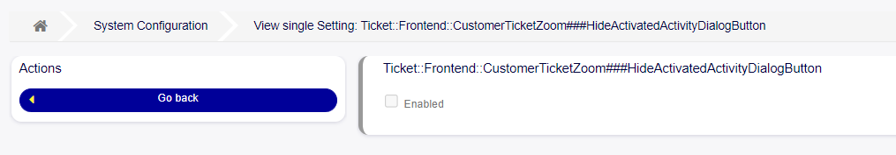
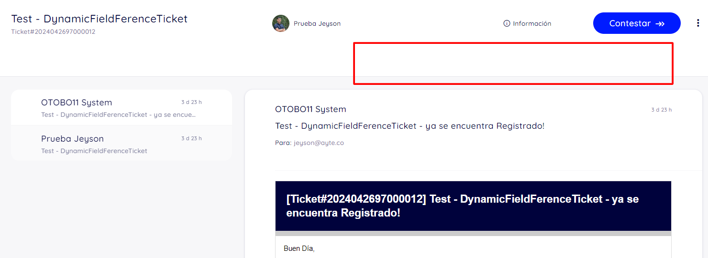

(CustomerTicketZoom) Hiding Button
~~~~~~~~~~~~~~~~~~~~~~~~~~~~~~~~~~~~~~~~

Now it's possible to hide an activity dialog in the main panel and expanded view of a ticket, in the customer interface. To do this, navigate to ``Admin -> System Configuration``, to the setting **Ticket::Frontend::CustomerTicketZoom###HideActivatedActivityDialogButton**.

   Hiding Button Settings

When enabled, you'll be able to hide activity dialogues in the customer interface by clicking on them.

   Hiding Button Displayed

