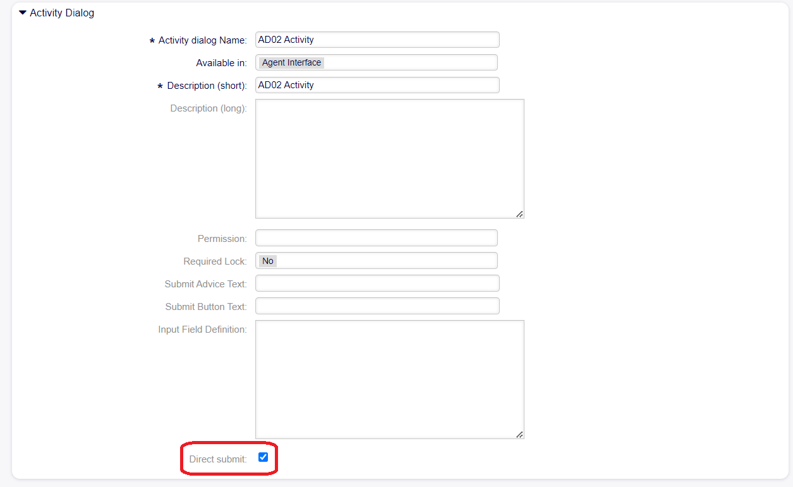

Direct Submit functionality
~~~~~~~~~~~~~~~~~~~~~~~~~~~~~~~~~~~~~~~~

The DirectSubmit functionality allows for a streamlined user experience by bypassing the additional process dialog in both agent and customer interfaces when required. When all fields in an activity dialog within the process management system are configured to operate in the background (not displayed or shown to the user), the "Direct Submit" option can be enabled. This ensures that actions such as acceptance or denial are executed immediately upon submitting the corresponding action, without the need for an extra confirmation step.

   Direct Submit Field

By implementing DirectSubmit, organizations can optimize their process management workflows, ensuring that actions are executed swiftly and with minimal user intervention.

.. note::
   If one of the fields is set to be shown, the message error “This property won't take effect because there are fields configured as visible.” will be displayed.
