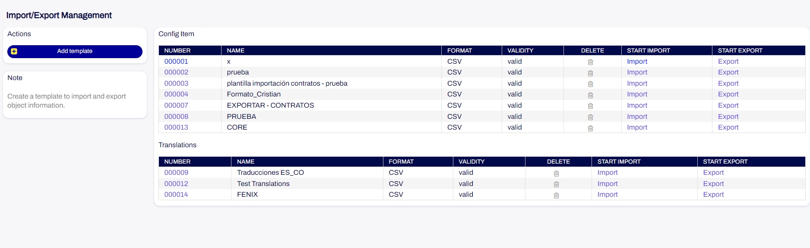
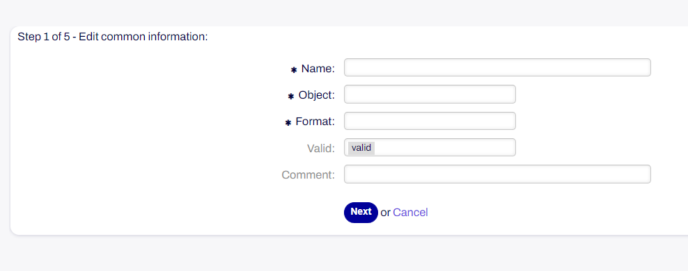
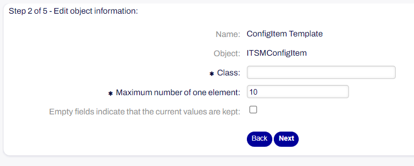
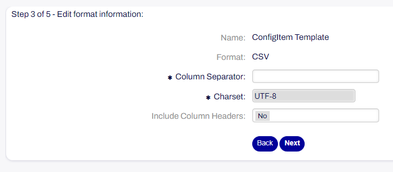
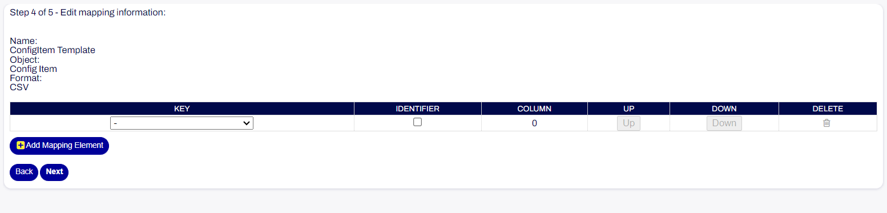
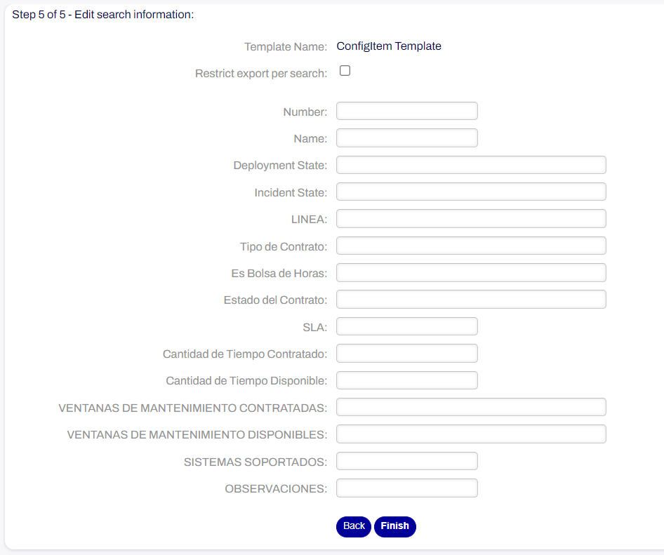
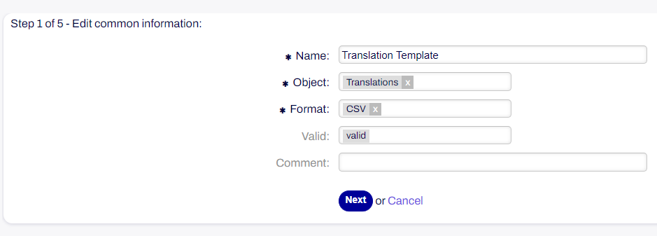
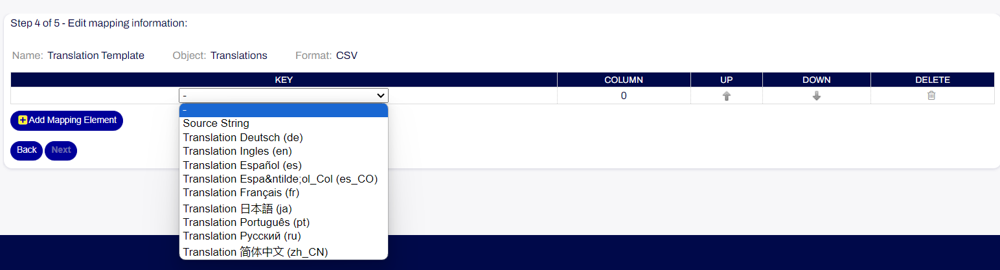

ImportExport Settings
~~~~~~~~~~~~~~~~~~~~~~~~~~~~~~~~~~~~~~~~

The ImportExport package allows you to create templates for importing and exporting configuration items and translation records. To take advantage of it, you should navigate to the Administrator panel, then select Import/Export.

   Import Export Management Screen

Config Item
------------------------

To create a template:

1. Click on the 'Add template' button.
2. Fill in the required fields in Step 1 of 5 - Edit common information. Under 'Object', you'll be asked if you want to create a template for Config item or Translations. The available format is 'CSV'.

   Edit common information step

3. Fill in the required fields in Step 2 of 5 - Edit object information. You should choose the class you want to import or export with the template, and specify the maximum number of an item.

   Edit object information step

4. Fill in the required fields in Step 3 of 5 - Edit format information. Here you can choose the desired Column Separator. The options are ``Colon (:)``, ``Comma (,)``, ``Dot (.)``, ``Semicolon (;)`` and ``Tabulator (TAB)``.

   Edit format information step

5. Fill in the required fields in Step 4 of 5 - Edit mapping information. You can choose an attribute of the CI as a mapping element.

   Edit mapping information step

6. Fill in the required fields in Step 5 of 5 - Edit search information. Here you can define the values for each attribute of the CI.

   Edit search information step

7. Click on the 'Finish' button.

Translations
------------------------

To create a template:
  
1. Click on the 'Add template' button.
2. Fill in the required fields in Step 1 of 5 - Edit common information. Under 'Object', you'll be asked if you want to create a template for Config item or Translations. The available format is 'CSV'.

   Edit common information step

3. Fill in the required fields in Step 2 of 5 - Edit object information.

.. figure:: images/import-translation-step2.png
   :alt: Edit object information step

   Edit object information step

4. Fill in the required fields in Step 3 of 5 - Edit format information. Here you can choose the desired Column Separator. The options are ``Colon (:)``, ``Comma (,)``, ``Dot (.)``, ``Semicolon (;)`` and ``Tabulator (TAB)``.

.. figure:: images/import-translation-step3.png
   :alt: Edit format information step

   Edit format information step

5. Fill in the required fields in Step 4 of 5 - Edit mapping information. You can choose one of the languages defined in the system.

   Edit mapping information step

6. Fill in the required fields in Step 5 of 5 - Edit search information. Here you can select a ticket attribute to have its untranslated characters exported.

.. figure:: images/import-translation-step5.png
   :alt: Edit search information step

   Edit search information step

7. Click on the 'Finish' button.
