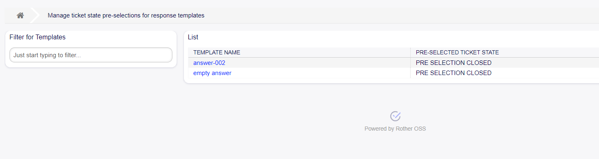
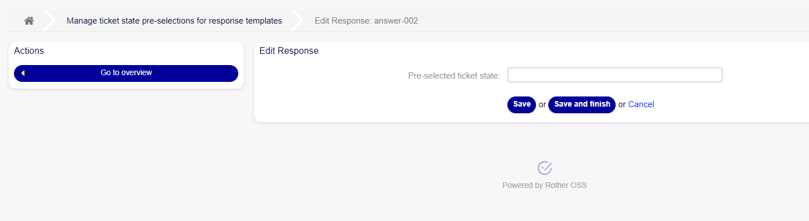

State Pre-selection for Templates
~~~~~~~~~~~~~~~~~~~~~~~~~~~~~~~~~~~~~~~~

The ‘State Pre-selection for Templates’ functionality introduces an administrative module that enhances the efficiency of ticket responses by allowing administrators to associate specific response templates with predefined states. This ensures that when a user replies to a ticket using one of these templates, the associated state is automatically preselected, streamlining the response process.	

   State Pre-selections for Templates Screen

To edit a state pre-selection in OTOBO, follow these steps:

1. Click on the template name you wish to link to a state.
2. Choose the state that will be pre-selected when the template is chosen.
3. Press the "Save" or "Save and Finish" button to save the changes.

   State Pre-selections for Templates Management

By implementing ‘State Pre-selection for Templates’, organizations can optimize their ticket response workflows, ensuring that replies are both swift and consistent, with minimal manual intervention required.

